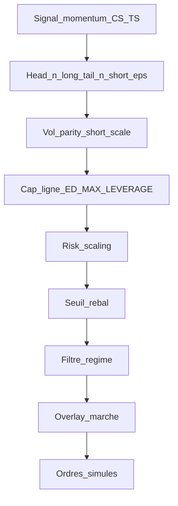

# Guide — Rebalancement, book, coûts (Train 1)

Objectif : réduire le **turnover** et améliorer le **Sharpe net** sans optimiser sur validation/OOS. Toute expérimentation sur **2015-01-01 → 2019-12-31** seulement.

## 1. Fréquence de rebalance (calendrier)

Définie par `rebalancing_frequency` dans [`configs/strategy_defaults.yaml`](../../configs/strategy_defaults.yaml), lue via `config` dans le moteur :

| Valeur | Comportement |
|--------|----------------|
| `monthly` | Premier jour de chaque nouveau mois (défaut historique) |
| `weekly` | Première séance d’une nouvelle semaine ISO |
| `quarterly` | Jan / Avr / Jul / Oct (début de trimestre) |
| `daily` | Chaque jour de séance |

Implémentation : [`event_driven/rebalance_calendar.py`](../../src/momentum_strategy/event_driven/rebalance_calendar.py).

## 2. Seuil anti micro-trade (rebal threshold)

Réduit les trades quand les poids cibles changent peu. Défaut `REBALANCE_THRESHOLD_DEFAULT` ; surcharge CLI `--rebalance-threshold` ou YAML de batch.

**Sweeps recommandés** : fichier [`configs/sensitivity_rebal_train1.yaml`](../../configs/sensitivity_rebal_train1.yaml).

```bash
mstrat sensitivity-batch --presets configs/sensitivity_rebal_train1.yaml \
  --start 2015-01-01 --end 2019-12-31 \
  --output results/institutional/sensitivity_rebal_train1
```

Après une variante prometteuse, enchaîner :

```bash
mstrat cost-stress-grid --start 2015-01-01 --end 2019-12-31 --mults 1.0,1.5,2.0 \
  --output results/institutional/train1_cost_stress_after_rebal
```

(ajuster `--rebalance-threshold` sur un run `event-backtest` dédié si le grid ne le supporte pas — le batch ci-dessus intègre le seuil par scénario.)

## 3. Prise de position (book)

| Levier | CLI | YAML batch (`sensitivity-batch`) |
|--------|-----|----------------------------------|
| N candidats L/S | `--n-long`, `--n-short` | `n_long`, `n_short` |
| Cap par ligne | `--max-position-size` | `max_position_size` |
| Levier brut ED | `--ed-max-leverage` | `ed_max_leverage` |
| Seuil \|signal\| entrée | `--ed-signal-entry-eps` | `ed_signal_entry_eps` |

Fichier d’exemples : [`configs/sensitivity_book_train1.yaml`](../../configs/sensitivity_book_train1.yaml).

Valeurs permanentes aussi dans `strategy_defaults.yaml` : `ed_max_leverage`, `ed_signal_entry_eps`, `max_position_size`.

## 4. Critères et note

Appliquer [CRITERES_SELECTION.md](CRITERES_SELECTION.md), reporter les tableaux dans [NOTE_RECHERCHE_EVENT_DRIVEN.md](NOTE_RECHERCHE_EVENT_DRIVEN.md).

## 5. Couches risque (overlay, flat)

Voir [RISK_LAYERS_TRAIN1.md](RISK_LAYERS_TRAIN1.md) — **une** couche à la fois.

## 6. Ordre du pipeline event-driven (audit)

Enchaînement réel dans le moteur (à lire de haut en bas pour expliquer un plateau ou un gross effondré) :

1. **Signal momentum** — pipeline CS + TS (`signal_final` du jour).
2. **Book** — tri cross-section ; `head(n_long)` / `tail(n_short)` ; filtre `ED_SIGNAL_ENTRY_EPS`.
3. **Vol parity** — mise à l’échelle par vol EWMA ; shorts × `ED_SHORT_NOTIONAL_SCALE`.
4. **Contraintes** — cap ligne `MAX_POSITION_SIZE` ; gross ≤ `ED_MAX_LEVERAGE`.
5. **Risk scaling** — multiplicateur régime / vol (`risk_scaling` dans les stats).
6. **Seuil de rebalance** — évite les micro-trades si Δw faible.
7. **Filtre régime** — réduction / hard-flat selon régime risque (voir `gross_after_old_regime_filter`).
8. **Informed tilt** — ajustement d’exposition (métadonnées `informed_tilt_*`).
9. **Overlay marché** — `gross_after_market_overlay` (souvent proche du gross effectif cible avant ordres).
10. **Ordres** — génération puis exécution (slippage / commission).

Schéma synthétique :



## 7. Lecture des CSV pour diagnostiquer une courbe « plate »

Colonnes utiles dans **`stats_*.csv`** (export `EventDrivenEngine.save_results`) :

| Colonne | Usage |
|---------|--------|
| `signal_generation_reason` | Warm-up (`INSUFFICIENT_HISTORY`), signal vide, suspension, etc. |
| `trading_suspended` / `dd_max_stop` / `suspended_days` | Circuit breaker — trading coupé. |
| `defensive_flat_phase` / `defensive_flat_reason` | Cash défensif (si couche activée). |
| `gross_after_old_regime_filter` | Gross après filtre régime — baisse forte en CRISIS / RISK_OFF. |
| `gross_after_market_overlay` | Gross après overlay marché — explique des plateaux avec peu d’exposition résiduelle. |
| `risk_regime_name` / `market_regime_effective` | Contexte régime au jour J. |
| `rebalancing_day` / `n_orders` / `final_turnover` | Rebal sans ordre possible (seuil, poids inchangés). |

Dans **`rebal_diagnostics_*.csv`** (jours de rebalance) : mêmes agrégats gross + `target_weights_json` (si présent) pour reconstruire le book cible.

Exemple documenté : en 2018–2019, des plateaux coexistent souvent avec **`risk_regime_name` = CRISIS** et **`market_regime_effective` = RISK_OFF** sans `trading_suspended` — ce n’est pas le breaker, c’est la **compression du gross** par les couches 7–9.

## 8. Benchmark EW dans le HTML « stratégie vs benchmark »

Le rapport généré par `strategy_benchmark_compare` construit un **buy-and-hold équipondéré** à partir de la matrice de prix : **pas de frais de transaction ni de slippage** sur ce benchmark. La stratégie event-driven, elle, inclut coûts. Deux modes de lecture institutionnels :

- **Mode A** — Comparer la **forme** et le **DD relatif** (mandat différent, coûts asymétriques acceptés comme hypothèse).
- **Mode B** — Interpréter surtout la **perf nette** de la stratégie et les stress coûts ([COST_STRESS.md](COST_STRESS.md)) ; ne pas conclure « alpha vs EW » sans rappeler l’absence de coûts côté EW.

Une variante EW **rebalancée avec coûts** n’est pas implémentée par défaut (choix méthodologique fort) ; toute extension doit être versionnée séparément.
